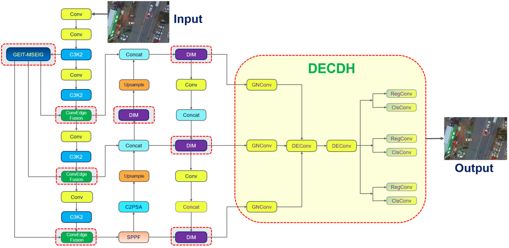
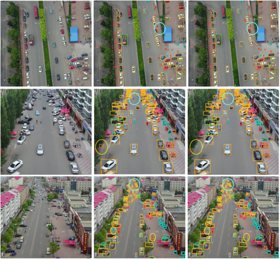

# GDD-YOLO：An Efficient Real-Time Small Object Detection Framework with Edge Awareness and Dynamic Convolution
Tieshan Zhang1,2,*, Shaoyuan Xi2, Dongyue Chen1, Zhong Ren1,2
1College of Information Science and Engineering, Northeastern University
ShenYang, LiaoNing,110819, China
2Department of Electrical Engineering, Ningxia Institute of Science and Technology
ShiZuiShan, NingXia,753000, China
Corresponding author's e-mail*: zts336699@126.com

# The core file description is as follows:
We have provided the complete implementation codes of three core innovative modules of GDD-YOLO, which are the key to optimizing the accuracy and computational efficiency of small target detection.

### (1) GEIT module
Implements the Global Edge Information Transmission (GEIT) module, including a multi-scale edge information generator based on the Sobel operator (MSEIG) and a cross-channel fusion mechanism ConvEdgeFusion. It supports extracting shallow high-resolution edge features and achieving cross-scale edge information enhancement, effectively improving the accuracy of small target localization.

### (2) DIM module
Implements the Dynamic Mixed Convolution (DIM) module, integrating the adaptive adjustment mechanism of dynamic kernel weights (DKW), depthwise separable convolution, and multi-scale parallel convolution branches. It achieves efficient cross-scale feature fusion while reducing model parameters and computational complexity.

### (3) DECDH
Implements the Lightweight Shared Detail Enhancement Convolution Detection Head (DECDH), including group normalization convolution (GNConv), detail enhancement convolution (DEConv) layers, and shared convolution strategy. It reduces parameter redundancy while maintaining the ability to fuse local details with global context.

### (4) Training, testing and validation scripts
We have provided end-to-end model training, testing and validation scripts that are fully compatible with the experimental settings in the paper. The key files are as follows:
- train.py: Training script, supporting hyperparameter configuration (consistent with the paper: SGD optimizer, learning rate 0.01, 300 training rounds, batch size 8, momentum 0.937), capable of loading the YOLOv11-S benchmark model, integrating the three core modules, and training on the VisDrone dataset.
- test.py: Testing script, after training, it can calculate key evaluation metrics (mean average precision mAP, precision, recall, frame rate FPS, gigaflops GFLOPs), support batch inference on the test set and output detailed performance reports, can be directly used for result comparison with mainstream algorithms.
- val.py: Validation script, used for real-time monitoring of model performance (such as AP50 curve, loss changes), automatically validates on the VisDrone validation set after each training round, and saves the model weights with the best performance.
## Project operating environment
If you wish to run GDD-YOLO from source code, you will need to set up Python on your operating system.

Install Python releases:

• Read the beginner's guide to Python if you are new to the language: https://wiki.python.org/moin/BeginnersGuide

• For Windows users, Python 3 release can be downloaded via: https://www.python.org/downloads/windows/

• For Mac OS users, Python 3 release can be downloaded via: https://www.python.org/downloads/mac-osx/

• GDD-YOLO only supports Python 3 onwards, Python 3.8, 3.9, 3.10 are recommended for better compatibility and performance

Install Anaconda Python distribution:

• Read the install instruction using the URL: https://docs.continuum.io/anaconda/install

• For Windows users, a detailed step-by-step installation guide can be found via: https://docs.continuum.io/anaconda/install/windows

• For Mac OS users, a detailed step-by-step installation guide can be found via: https://docs.continuum.io/anaconda/install/mac-os.html

• An Anaconda Graphical installer can be found via: https://www.continuum.io/downloads

• We recommend users install the latest Anaconda Python distribution

Install packages:

• OrchardQuant-3D uses a number of 3rd-party libraries that you may need to add to your conda environment. These include, but are not limited to:

python: 3.10.14
torch: 2.2.2+cu121
torchvision: 0.17.2+cu121
timm: 1.0.7
mmcv: 2.2.0
mmengine: 0.10.4
Matplotlib=3.7.3
Pandas=2.0.3
Numpy=1.23.2

## Running GDD-YOLO
After successfully installing the required third-party libraries, you can obtain the files needed for running the code from what we provide. Then, please run the latest version of the code we offer to obtain the result data. To shorten the running time, we also include a multi-process version of the code.

